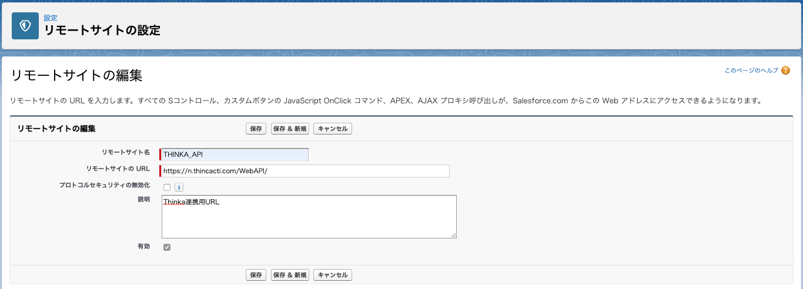

# SalesforceシンカCTI連携
## 準備
1. カスタム表示ラベルを2つ用意  

|名前|値|
|:----|:----|
|THINKA_ID|シンカCTIの顧客ID|
|THINKA_SECRET|シンカCTIのSecretLetter|

2. 下記キャプチャを参考に「リモートサイトの設定」  
  


3. ソースを環境にアップロード  

## 使い方
連携クラスのインスタンスを生成して
```Apex
THINKA_Integrator integrator = new THINKA_Integrator();
```
使いたいメソッドを呼び出す。
```Apex
integrator.userSearch('山田', 0, 100);
```
結果はすべて THINKA_IntegrateDTO で返される。
```Apex:THINKA_IntegrateDTO
public with sharing class THINKA_IntegrateDTO {
    public Boolean isSuccess = true;
    public String msg;
    public List<String> data;
}
```
顧客情報登録などの自由項目のJSON作成
```Apex
sObject record; // 処理対象Salesforceレコード
List<String> fields; // 処理対象の項目名のリスト
THINKA_JSONGenerator gen = new THINKA_JSONGenerator().setRecord(record)).setFields(fields);
String infoJSON = gen.generateJSON();
```

## 注意事項
- データの更新条件はシンカCTI WebAPIに依拠する。
- Apexトリガを使用した処理に組み込むことはできない。
- 今のところ画像操作のAPIには未対応。

## サンプルアプリケーション(Salesforce->シンカCTI連携)
### 概要
取引先責任者詳細ページにアクションを設置し、そのアクション実行時に開いている取引先責任者のデータをシンカCTIへ連携する
### 項目マッピング

|Salesforce項目Api名|シンカCTI項目名|
|:----|:----|
|Phone|tel|
|LastName|name|
|マッピングなし|name_kana|
|MailingAddress|addr|
|マッピングなし|sex|
|Birthdate|d_o_b|
|Description|status|

すべて取引先責任者オブジェクトとのマッピング
